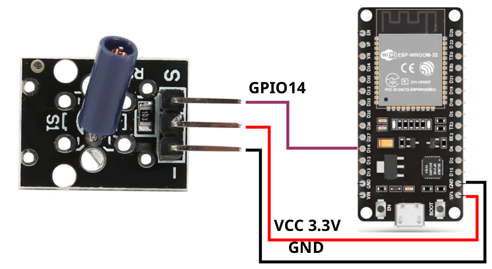

# ESP32 Vibration Sensor Monitor

Real-time vibration monitoring system using ESP32 and KY-002 Vibration Switch Module with web-based visualization.

[](https://www.espressif.com/en/products/socs/esp32)
[](https://platformio.org/)
[](LICENSE)

## 📋 Features

- **Real-time Vibration Detection**: High-sensitivity monitoring at 100Hz sampling rate
- **Live Web Dashboard**: Responsive web interface with real-time updates
- **Historical Data Visualization**: Chart.js powered graph showing last 1 second of data (100 readings)
- **Event Counter**: Tracks total number of vibration events
- **WiFi Connectivity**: Supports both WiFi Client and Access Point modes
- **Persistent Configuration**: WiFi credentials saved in EEPROM
- **Visual Indicators**: LED feedback and animated web indicators
- **Serial Logging**: Debug output via USB serial connection

## 🔧 Hardware Requirements

- **ESP32 Development Board** (ESP32-WROOM)
- **KY-002 Vibration Switch Module**
- **Jumper Wires**
- **USB Cable** for programming and power

## 📐 Hardware Connection



### Pin Configuration

| KY-002 Module | ESP32 Pin | Description |
|---------------|-----------|-------------|
| VCC           | 3.3V      | Power supply |
| GND           | GND       | Ground |
| S (Signal)    | GPIO 14   | Digital signal output |

**Internal LED**: GPIO 2 (Built-in LED on most ESP32 boards)

### KY-002 Sensor Specifications

- **Operating Voltage**: 3.3V - 5V
- **Output Type**: Digital (LOW when vibration detected, HIGH when idle)
- **Detection Method**: Spring-loaded vibration switch
- **Sensitivity**: Adjustable via physical design (non-adjustable electronically)

## 🚀 Software Setup

### Prerequisites

- [PlatformIO](https://platformio.org/) (VS Code extension recommended)
- ESP32 development environment

### Installation

1. **Clone the repository**:
   ```bash
   git clone https://github.com/SimedruF/ESP32_VibrationSensor.git
   cd ESP32_VibrationSensor
   ```

2. **Open in PlatformIO**:
   - Open the project folder in VS Code with PlatformIO extension installed
   - PlatformIO will automatically install required dependencies

3. **Build the project**:
   ```bash
   pio run
   ```

4. **Upload to ESP32**:
   ```bash
   pio run --target upload
   ```

5. **Monitor serial output** (optional):
   ```bash
   pio device monitor
   ```

## 📡 WiFi Configuration

### Access Point Mode (Default)

On first boot, the ESP32 creates a WiFi Access Point:

- **SSID**: `ESP32_VibrationSensor`
- **Password**: `12345678`
- **IP Address**: `192.168.4.1`

Connect your device to this network and navigate to: `http://192.168.4.1`

### Client Mode (Connect to Your WiFi)

1. Access the web interface via Access Point mode
2. Navigate to the **WiFi** tab
3. Enter your WiFi network credentials:
   - SSID (network name)
   - Password
4. Click **Save and Connect**
5. The ESP32 will restart and connect to your network
6. Check Serial Monitor for the assigned IP address
7. Access the interface at the new IP address

**Note**: WiFi credentials are stored in EEPROM and persist across reboots.

## 🖥️ Web Interface

### Dashboard Tab

- **Status Indicator**: Real-time visual indicator (green/red with shake animation)
- **Event Counter**: Total number of vibration events detected
- **Last Detection**: Time elapsed since last vibration event
- **Live Chart**: Real-time graph showing last 100 readings (1 second history)

### WiFi Configuration Tab

- Configure WiFi client credentials
- View connection status
- Clear saved configuration

### Features

- **Auto-refresh**: Updates every 300ms
- **Responsive Design**: Works on desktop and mobile devices
- **No Page Reload**: AJAX-based updates for smooth experience

## 📊 Technical Details

### Sampling Rate

- **Reading Frequency**: 100 Hz (every 10ms)
- **Buffer Size**: 100 readings (1 second of history)
- **Web Update Rate**: 300ms (approximately 3 updates per second)

### Detection Algorithm

```cpp
// High-sensitivity detection
if (digitalRead(GPIO14) == LOW) {
    vibrationDetected = true;
    holdIndicatorFor(200ms);  // Visual feedback hold time
}
```

**Hold Time**: 200ms - keeps LED and indicator active even for very short vibration pulses

### Data Flow

```
Sensor (100Hz) → Circular Buffer (100 readings) → Web Request (300ms) → Chart.js Visualization
```

## 🔍 API Endpoints

### GET `/`
Returns the main HTML interface

### GET `/data`
Returns JSON with current sensor data:
```json
{
    "state": 0,              // Current vibration state (0 or 1)
    "count": 42,             // Total events detected
    "lastTime": "5s",        // Time since last detection
    "history": [0,0,1,0,...]  // Last 100 readings
}
```

### GET `/wifi_status`
Returns WiFi connection information:
```json
{
    "connected": true,
    "ssid": "MyNetwork",
    "ip": "192.168.1.100",
    "saved_ssid": "MyNetwork"
}
```

### POST `/wifi_config`
Configure WiFi credentials (form-encoded):
- `ssid`: Network name
- `password`: Network password

### GET `/wifi_clear`
Clear saved WiFi configuration

## 🎨 Customization

### Adjust Sensitivity

Modify the detection hold time in `main.cpp`:
```cpp
const unsigned long VIBRATION_HOLD_TIME = 200; // milliseconds
```

### Change Sampling Rate

Adjust the loop delay:
```cpp
delay(10); // 10ms = 100Hz
```

### Modify Buffer Size

Change the buffer size for more/less history:
```cpp
const int BUFFER_SIZE = 100; // 100 readings = 1 second at 100Hz
```

### Update Chart Refresh Rate

In the HTML section, modify:
```javascript
setInterval(updateData, 300); // milliseconds
```

## 🐛 Troubleshooting

### No Vibration Detection

1. **Check wiring**: Verify GPIO14 connection
2. **Test sensor**: Tap it firmly - you should hear a small click
3. **Serial Monitor**: Look for detection messages
4. **Sensitivity**: KY-002 requires moderate to firm taps

### Cannot Connect to WiFi

1. **Check credentials**: Ensure SSID and password are correct
2. **Signal strength**: Move closer to WiFi router
3. **Reset configuration**: Use the "Clear" button in WiFi tab
4. **Fallback**: ESP32 will return to Access Point mode if connection fails

### Web Interface Not Loading

1. **Check IP address**: Verify in Serial Monitor
2. **Firewall**: Temporarily disable firewall/antivirus
3. **Browser cache**: Clear cache or try incognito mode
4. **Direct IP**: Use IP address, not hostname

## 📝 Serial Monitor Output

Example output:
```
=== ESP32 + KY-002 Vibration Sensor ===
Senzor conectat pe GPIO 14

=== CONFIGURARE WIFI ===
WiFi credentials loaded from EEPROM
SSID: MyNetwork

✅ Mod: WiFi Client
Deschide in browser: http://192.168.1.100

✅ Server web pornit!
Monitorizare senzor vibrație în timp real
========================================

⚠️ VIBRAȚIE DETECTATĂ! #1
⚠️ VIBRAȚIE DETECTATĂ! #2
⚠️ VIBRAȚIE DETECTATĂ! #3
```

## 📸 Screenshots

### Dashboard View
- Real-time vibration status indicator
- Historical data chart
- Event counter and timing

### WiFi Configuration
- Simple credential input
- Connection status display
- Configuration management

## 🧰 Project Structure

```
ESP32_VibrationSensor/
├── src/
│   └── main.cpp           # Main application code
├── include/               # Header files
├── lib/
│   └── WiFiWebManager/    # Reusable WiFi & WebServer library
│       ├── WiFiWebManager.h
│       ├── WiFiWebManager.cpp
│       └── README.md      # Library documentation
├── img/
│   └── ESP32_KY02_VibrationSensor.png  # Wiring diagram
├── platformio.ini         # PlatformIO configuration
└── README.md             # This file
```

## 📚 WiFiWebManager Library

This project includes a **reusable library** for managing WiFi connectivity and web server functionality. The `WiFiWebManager` class can be easily extracted and used in other ESP32 projects.

### Key Features

- Automatic WiFi client/AP mode switching
- Persistent credential storage in EEPROM
- Simple callback-based route registration
- Built-in WiFi management endpoints
- Zero-configuration setup

### Using WiFiWebManager in Other Projects

To use this library in your own projects:

1. **Copy the library folder**:
   ```bash
   cp -r lib/WiFiWebManager /path/to/your/project/lib/
   ```

2. **Include in your code**:
   ```cpp
   #include "WiFiWebManager.h"
   
   WiFiWebManager wifiManager("MyAP", "password", 80);
   
   void setup() {
       wifiManager.begin();
       wifiManager.on("/", HTTP_GET, handleRoot);
   }
   
   void loop() {
       wifiManager.handleClient();
   }
   ```

3. **See full documentation**: [lib/WiFiWebManager/README.md](lib/WiFiWebManager/README.md)

This modular approach makes it easy to reuse the WiFi and web server management code across multiple projects without duplicating code.

## 🔒 Security Note

The default Access Point password (`12345678`) should be changed in production environments. Modify the password in `main.cpp`:

```cpp
const char* ap_password = "YourSecurePassword";
```

## 🤝 Contributing

Contributions are welcome! Please feel free to submit a Pull Request.

1. Fork the repository
2. Create your feature branch (`git checkout -b feature/AmazingFeature`)
3. Commit your changes (`git commit -m 'Add some AmazingFeature'`)
4. Push to the branch (`git push origin feature/AmazingFeature`)
5. Open a Pull Request

## 📄 License

This project is open source and available under the [MIT License](LICENSE).

## 👤 Author

**SimedruF**

- GitHub: [@SimedruF](https://github.com/SimedruF)

## 🙏 Acknowledgments

- [Chart.js](https://www.chartjs.org/) for the beautiful charts
- [PlatformIO](https://platformio.org/) for the excellent development platform
- ESP32 community for extensive documentation and support

## 📚 Additional Resources

- [ESP32 Documentation](https://docs.espressif.com/projects/esp-idf/en/latest/esp32/)
- [PlatformIO Documentation](https://docs.platformio.org/)
- [KY-002 Sensor Information](https://arduinomodules.info/ky-002-vibration-switch-module/)

## 🔄 Version History

- **v1.0.0** (2026-03-07)
  - Initial release
  - Real-time vibration monitoring
  - Web-based dashboard
  - WiFi configuration support
  - High-sensitivity detection (100Hz sampling)
  - Circular buffer with 1-second history

---

**Made with ❤️ for ESP32 and IoT enthusiasts**
